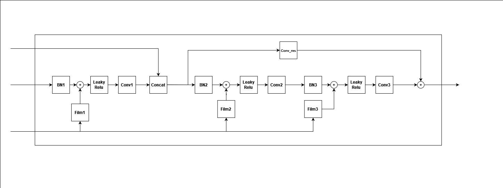

# Separate anything you describe
This repository contains an implementation of the official paper [Separate anything you describe](https://github.com/Audio-AGI/AudioSep)

#### Description
___
The task of this project is known as **Language Query Audio Separation (LASS)** in which given an audio mixture, the scope is to separate a specific sound related to a text query (in natural language).

#### The Architecture
---


The above architecture proposed in the original paper of AudioSep is made by a Language Query encoder and a separation model, respectively called **QueryNet** and **SeparationNet**.
For the former we used the text-encoder and audio-encoder of [CLAP](https://github.com/LAION-AI/CLAP) as suggested in the paper, while for the latter we have built from scratch the whole architecture. 

#### SeparationNet
---

The separationNet takes as input the audio to process and the output of CLAP. At the beginning the audio is preprocessed with a **Short time fourier transform (STFT)** in order to extract **the magnitude and the phase** of the waveform.
At this point the magnitude spectrogram goes through the following ResUnet(encoder-decoder architecture).


This network is composed by **7 encoder blocks and 6 decoder blocks**.
Every **encoder block** contains **2 batch normalization layers, 2 CNN layers and 2 Leaky Relu** layers and if the number of channels in input is different from the ones in output there is another convolution on the initial input that is summed with the previous result giving raise to a **Residual block**.
A further **average pool layer** is applied to this final value.

.png)

In every **decoder block** instead first we have a ConvTranspose2D that allows to upsample the input, then a skip connection is established between the encoder and the decoder that works on the same sampling rate and then we have almost the same architecture of the encoder except for the pool layer, resulting in this kind of block.



In order to correlate the QueryNet and the SeparationNet, to each feature map of the Separation model is applied another layer called **Feature Wise Linearly modulated layer (Film)**, that essentially is a MLP with 2 fully connected layers that takes as input the embedding of CLAP and the size of the feature map. It returns a value for each channel of the feature map that has to be summed with it.


The outputs of the whole SeparationNet are **a magnitude mask and a phase mask** that depend on the text embedding of the QueryNet. 

These masks have to be applied to the orignal inputs in order to recover the **separated complex spectogram**. At the end we can perform the inverse Short time Fourier transform to obtain the desired waveform.

Our implementation is made by three models, the first one big as the one proposed in the audioSep paper, one with the same number of encoder and decoders but has a lower number of channels (like in the gitHub implementation of the paper) and the last one which is the smallest composed by 4 encoder and 4 decoder blocks in the resUnet.

#### Training and loss
---
For training we downloaded a subset of audios in the balanced training dataset of [AudioSet](http://research.google.com/audioset/). In order to build a sample used in the training we get two random samples from this dataset, we combine these two audios as done in the original paper.

Then from this mixture we extract a 5 seconds random sample, and taking as labels the labels of the first audio, we pass them as input of the network.


#### Testing
---

For testing we used another dataset from AudioSet, called Evaluation Data, in which there are samples that are not in the training dataset.
During testing phase, a given number of classes of audio are randomly chosen and for each of it, we take other 5 random classes that have to be mixed with the initial ones. To evaluate the result, we return the loss of each experiment, and we plot the spectrograms in order to have a look to the result.

#### Requirements
----
The required packets to run this project are in the file [requirements.txt](https://github.com/LorenzoFrangella/Neural-Networks-Mastrandrea-Frangella/blob/main/requirements.txt)
and run:
```pip3 install -r requirements.txt```


#### Installation
---
To run this project is necessary to open the file project_nn.ipynb which is a jupiter notebook and run one by one the cells. 


#### References 
---


